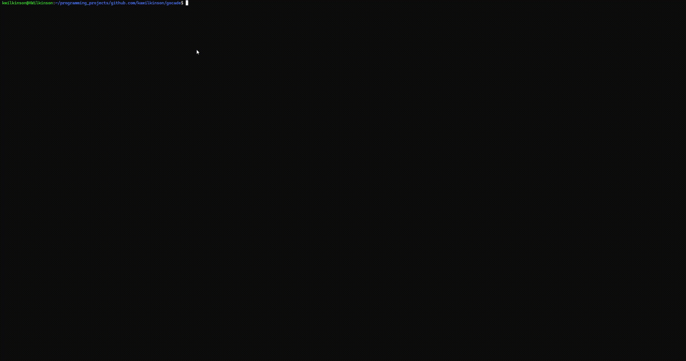
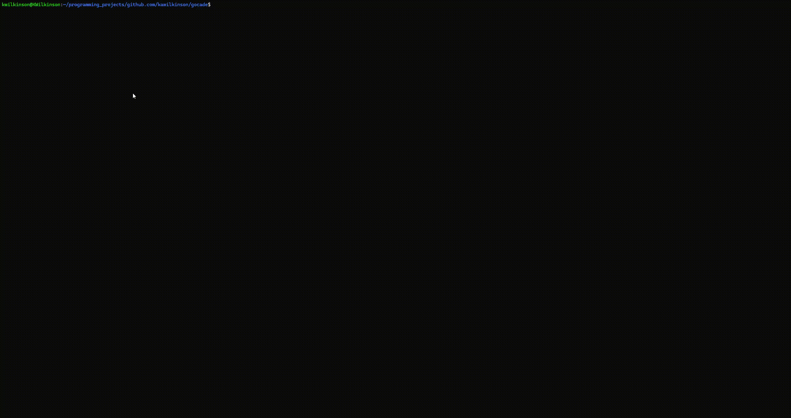
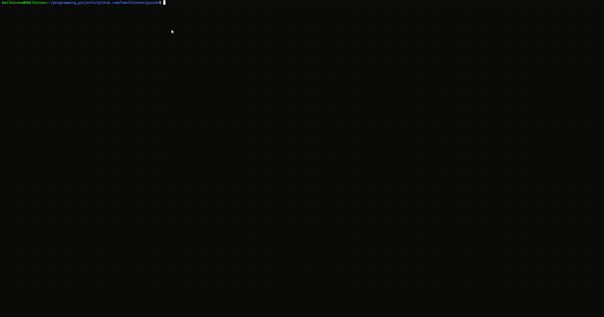

# Gocade



## What is Gocade?

Gocade is a TUI application built with Bubble Tea! The goal of this project was to build a fun virtual arcade machine that is modular and able to add new games with relative ease. The arcade machine allows you to play a variety of games in one place along with having leaderboards for each game and its game modes.

It's built to be able to swap between the arcade machine, leaderboards, and games with ease, no need to restart the application unless you're done playing with it! 

## 🔔 Motivation

This project was built over the course of a few days during the 2025 [boot.dev](https://www.boot.dev/) hackathon! I tried to choose a project that is ambitious and would give me a ton to learn, and this project succeeded in allowing me to much more deeply understand Bubble Tea and how to make a TUI application with it! Getting more practice with Golang never hurts either.

## 🚀 Installation / Quick Start

1. First, ensure you have the latest version of Go installed, I built this app using Go 1.24.1 so earlier versions are not tested.

2. Clone the repository:

```sh
git clone https://github.com/kawilkinson/gocade
```

3. Build and run the app from the root (where main.go is):

```sh
go run .
```

That's it! This app is purely built with Go since one of my goals was to make it as easy to run as possible. Once you're running the app feel free to play around and most importantly: have fun!

## 📋 Project Layout

Currently the project is broken up into 3 parts:
1. The arcade machine
2. The games
3. The leaderboards 

### 🕹️ Arcade Machine
This is the essentially the main menus for the app. This is where you'll be able to browse games and start them along with viewing the local leaderboards for each game.

### 🎮 Games

Gocade currently has 2 games. These games include:

#### Tetris
This game would not have been possible to implement without massive credits to [Tetrigo](https://github.com/Broderick-Westrope/tetrigo), his code helped a ton with the logic of the game and also teaching/showing me what a more large scale Bubble Tea app looks like! I made various edits to their game to make it fit with my arcade machine and to help me understand exactly how they made this game possible with Bubble Tea. Here's the game in action:



Controls for the game are located in the help menu once you're inside the game.

#### Snake
The classic game Snake!



Controls for the game are located in some help text once you're inside the game.

#### ** More Games To Come **

### 🏆 Leaderboards
I decided to go for a very simple but effective implementation for the leaderboards; a simple csv file for each game and its game mode. Each leaderboard gets generated once you either try to view a leaderboard (if there are no scores yet) or you finish a game/game mode once. 

It is generated in ./internal/leaderboard/data

Each leaderboard is sorted in descending order based on highest score.

## 📃 TODO
- Add more games (can never have too many)
- Add more style to the Snake game to make it more fancy
- Extra features to Snake game such as a sprint key to go faster, more dangerous but bonus points if done!
- Fix bugs as they come up, for example the menu for Snake game is a little buggy with how it renders.

## 🤝 Contributing
If you have any ideas for this project whether it'd be new features, optimizations, etc. feel free to share them. I'm always open to new ideas and improvements.

## Credits
1. Credits to Gyga8K for their amazing Gopher [image](https://forum.golangbridge.org/t/image-big-gopher/3489) that I was able to use in my arcade menus

2. Thank you [Bubble Tea](https://github.com/charmbracelet/bubbletea) for being an awesome TUI framework!

3. Finally, thank you [Tetrigo](https://github.com/Broderick-Westrope/tetrigo) for inspiring me with ideas on how to handle making games with Bubble Tea
